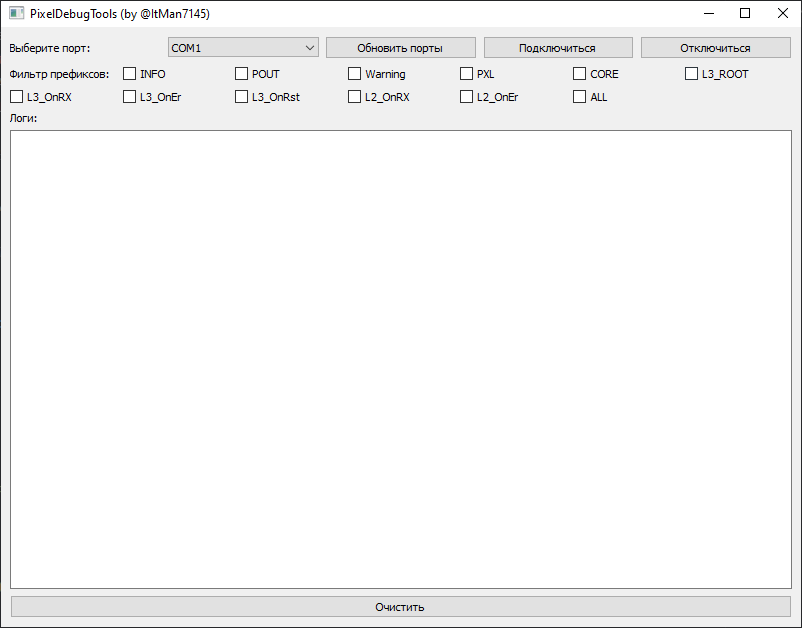

# PixelDebugTools  

### Описание проекта:
Программа для сканирования и чтения данных `COM` порта компьютера, с дальнейшей фильтрацией и удобного вывода в окно приложения
 
 

 
 

**Инструкция по использованию программы**
* клонировать или скачать репозиторий
* установить библиотеки из файла requirements.txt. Для этого открыть терминал и прописать команду: `pip install -r requirements.txt`
* настроить скорость порта в переменной `baudRate`
* добавить фильтры в массив `prefixes`
* помолиться на индусов и запустить программу
* в окне выбрать порт (**кроме COM1**)
* нажать на кнопку `Подключится`

~~Моральная~~ поддержка : @ItMan7145 (telegram)